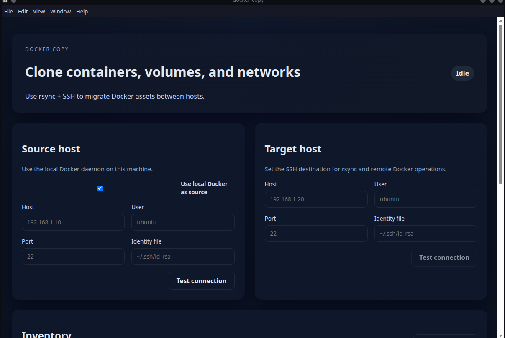

# Docker Copy


**Docker Copy** is a cross-platform desktop app for migrating Docker containers, volumes, and networks between hosts. It uses SSH and rsync for data transfer and relies on Docker CLI commands on both ends.



> Note: Container runtime configuration recreation is not fully automated yet. The plan includes placeholder steps to guide manual recreation.

## 🚀 Why Docker Copy

- Move Docker workloads between hosts with a guided, repeatable plan
- Review what will change before any action is taken
- Keep volume data in sync using rsync
- Keep migrations predictable with warnings and preflight checks

## ✨ Key Features

- Source/target host configuration over SSH
- Inventory listing for containers, volumes, and networks
- Migration plan preview with warnings
- Volume synchronization via rsync
- Target network and volume creation
- Friendly UI built with Electron + Vite

## 🧭 How it works

1. Connect to source and target hosts over SSH.
2. Read inventory (containers, volumes, networks).
3. Generate a migration plan (with warnings and placeholders).
4. Create missing target networks and volumes.
5. Sync volume data using rsync.
6. Recreate containers manually based on the plan output.

## ✅ Prerequisites

- Docker CLI available on both hosts
- SSH access to the target host
- rsync installed locally (and on the target host when syncing volumes)

## ⚡ Getting started

1. Install dependencies.
2. Start the development app.
3. Configure source and target hosts.
4. Generate and review the migration plan.

```bash
npm install
npm run dev
```

## 💡 Use cases

- Move workloads between on-prem hosts
- Migrate a homelab to new hardware
- Stage a migration plan before a maintenance window

## 🔐 SSH key setup for external Docker hosts

Use SSH keys to authenticate to remote Docker hosts without passwords.

1. Generate a key pair on the machine running Docker Copy. Use the modern ED25519 algorithm and protect it with a passphrase.
2. Copy the public key to the target host user you will connect as. The public key must be added to that user’s `~/.ssh/authorized_keys` file.
3. Ensure permissions are locked down on the target host: `~/.ssh` should be `700` and `authorized_keys` should be `600`.
4. Test the connection to confirm the host key is trusted and the key is accepted.
5. (Optional) Create an SSH config entry with the host alias, user, and identity file to simplify connections.

> Tip: For least-privilege access, create a dedicated migration user on the target host and grant only the required Docker permissions.

## 🛠️ Scripts

Common scripts (see package.json for the full list):

- dev: Run the Electron app with Vite in development
- build: Build the renderer and Electron main process
- package: Build a distributable app using electron-builder

## 🧰 Tech stack

- Electron 36
- React 19 + TypeScript
- Vite 7
- Docker CLI + SSH + rsync

## 📦 Packaging

Run the package script to build a distributable app using electron-builder.

```bash
npm run package
```

## 🛡️ Security notes

- Store SSH keys securely and use least-privilege users.
- Review generated migration commands before executing.
- Consider a dedicated migration user on the target host.

## 🗺️ Roadmap

- Container runtime configuration capture and replay
- Safer dry-run validation of remote actions
- Improved conflict detection and resolution

## 📄 License

Free to use under the MIT License. See [LICENSE](LICENSE).
